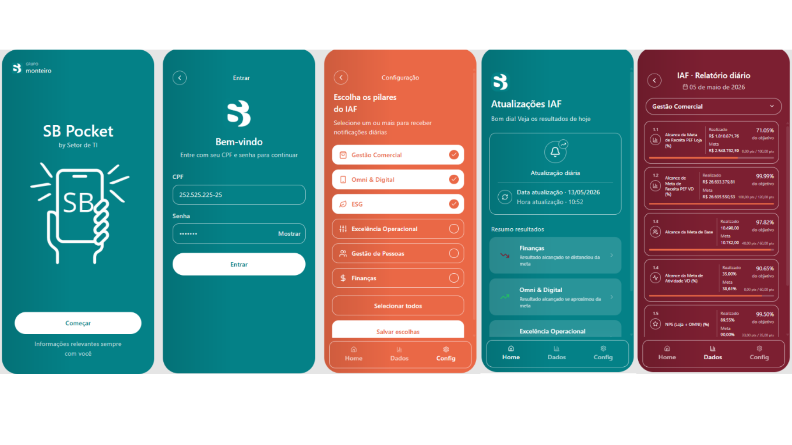

# SB Pocket — IAF Fácil

**PWA** · by Setor de TI · Grupo Monteiro SB

IAF Fácil é um app de guia de bolso da SB Monteiro para acompanhar as atualizações diárias do IAF. O usuário escolhe quais pilares deseja acompanhar — Gestão Comercial, Omni & Digital, ESG, Excelência Operacional, Gestão de Pessoas e Finanças — e recebe notificações conforme os indicadores se aproximam ou se distanciam das metas. O app também permite consultar o relatório diário, visualizar os resultados por pilar e acompanhar de forma rápida os principais pontos de atenção.



---

## Pilares do IAF

- Gestão Comercial
- Omni & Digital
- ESG
- Excelência Operacional
- Gestão de Pessoas
- Finanças

---

## Rodando o projeto

Instale as dependências:

```bash
npm i
```

Inicie o servidor de desenvolvimento:

```bash
npm run dev
```

Por ser uma PWA, o app pode ser instalado diretamente pelo navegador (Chrome/Edge → "Adicionar à tela inicial").

---

# N8N versão estáve:  "1 teste sbpocket" - May 15, 11:02:22